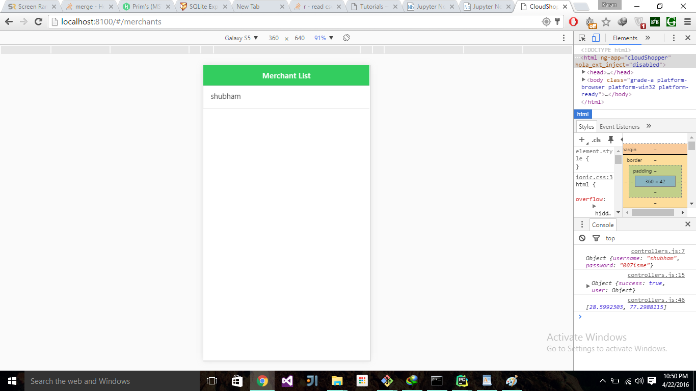
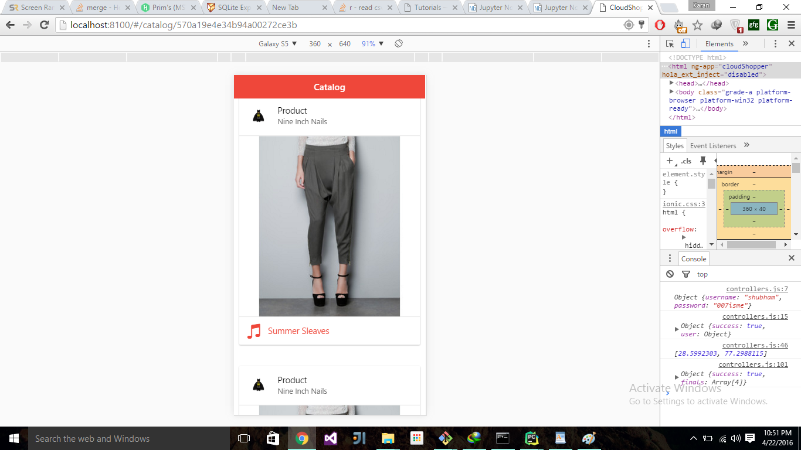

# Cloud-Shopper
## Project Description
This project aims to be an online companion for offline shopping. It shows user recommendations on what they should check out at a store by a feed generated by their buying statistics. -Gives them easy access to bills and return requests - Gives merchants analytics on their shoppers - give merchants ability to boost products through recommendations. All you ever needed while shopping offline was a catalog of the shop you're currently in. This application dynamically loads the catalog of the shop you're in using location tracking and recommends its best buys based on your history and the shop's specialties.

## Technologies used
* Angular js
*  Ionic
*  Express js
*  MongoDB
*  Materialize.css

## Made By

* Shubham Arora
* Rohit Gohri
* Saksham Kalsi
* Karanbir Chahal

(During the 16 hour NSIT Evolve Hackathon)

## Requirements

### nodejs
  Installation

    curl -sL https://deb.nodesource.com/setup_5.x | sudo -E bash -
    sudo apt-get install -y nodejs

  After Installation

    sudo apt-get install nodejs-legacy

  Check that you have node and npm(comes with node) successfully installed:

    $ node -v
    $ npm -v

### mongodb
  Installation :
  Follow the official instructions at:
    https://docs.mongodb.org/manual/tutorial/install-mongodb-on-ubuntu/

  Check mongo is installed by starting the server:

      mongod

# Features right now

User
* --> Register, Login for the users
* --> View catalogs

Merchant
* --> Register merchant
* --> Track location and check if location corresponds to existing merchant
* --> Send location's recommended searches

Recommender Engine
* --> Tracks user's purchase history to detect his purchase patterns
* --> Checks merchant's top and latest products to weigh in recommendation process
* --> Check user's details with similar customers' details to weigh in recommendation process

### modules:

  Clone the project using git and cd into it:

      git clone https://github.com/odin/CloudShopper.git

      cd CloudShopper

      cd frontend (For the ionic frontend)

      cd backend (For the node backend)

  Run npm install - this installs all the dependencies of the project (found in package.json) :

      npm install

## Run

  Start Mongo

    mongod

  Start App

    npm start (in the backend folder)

  Or wif you are using pm2

    pm2 start pm2_debug.json

  For starting Ionic Front end

    ionic serve (in the frontend folder)

## Photos

## API Description
* Login - POST
        http://localhost:3000/users/login

    Parameters
    * username
    * password

## To be continued..
